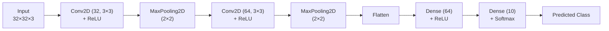

# CNN_Image_Classifier_CIFAR-10
Designed and implemented a deep learning image classifier using a Convolutional Neural Network (CNN) with TensorFlow and Keras. The model was trained on the CIFAR-10 dataset, incorporating data preprocessing, feature extraction, and model evaluation techniques to classify images across 10 object categories with high accuracy.

# 🖼️ CIFAR-10 Image Classifier — ANN vs CNN

A deep learning project that classifies images from the CIFAR-10 dataset into 10 categories, comparing a fully-connected Artificial Neural Network (ANN) baseline against a Convolutional Neural Network (CNN) built with TensorFlow/Keras.


---

## 📋 Table of Contents

- [Overview](#-overview)
- [Dataset](#-dataset)
- [Model Architectures](#-model-architectures)
- [Results](#-results)
- [Tech Stack](#-tech-stack)
- [Getting Started](#-getting-started)
- [Project Structure](#-project-structure)
- [Sample Predictions](#-sample-predictions)
- [Future Improvements](#-future-improvements)
- [License](#-license)

---

## 🔍 Overview

This project trains and compares two models on the CIFAR-10 image classification task:

1. **A baseline ANN** — fully-connected dense layers, no spatial awareness of pixels.
2. **A CNN** — convolutional layers that learn spatial features, leading to a significant accuracy improvement over the ANN.

The notebook walks through data loading, normalization, model building, training, evaluation, and visualizing both correct and incorrect predictions.

## 📦 Dataset

[**CIFAR-10**](https://www.cs.toronto.edu/~kriz/cifar.html) — 60,000 32×32 color images across 10 classes.

| Split | Images | Shape |
|---|---|---|
| Training | 50,000 | `(50000, 32, 32, 3)` |
| Test | 10,000 | `(10000, 32, 32, 3)` |

**Classes:** `airplane`, `automobile`, `bird`, `cat`, `deer`, `dog`, `frog`, `horse`, `ship`, `truck`

Pixel values are normalized to the `[0, 1]` range before training.

## 🧠 Model Architectures

<details>
<summary><b>1. Baseline ANN (click to expand)</b></summary>

```
Flatten(input_shape=(32, 32, 3))
Dense(3000, activation='relu')
Dense(1000, activation='relu')
Dense(10, activation='sigmoid')

Optimizer: SGD
Loss: sparse_categorical_crossentropy
Epochs: 5
```

Used as a simple baseline to demonstrate why spatial structure matters for image data — a flattened dense network has no way to learn local pixel patterns like edges or shapes.

</details>

<details>
<summary><b>2. CNN — Final Model (click to expand)</b></summary>

```
Conv2D(32 filters, 3×3, activation='relu')
MaxPooling2D(2×2)
Conv2D(64 filters, 3×3, activation='relu')
MaxPooling2D(2×2)
Flatten()
Dense(64, activation='relu')
Dense(10, activation='softmax')

Optimizer: Adam
Loss: sparse_categorical_crossentropy
Epochs: 10
```

</details>



## 📊 Results

| Model | Epochs | Optimizer | Test Accuracy |
|---|---|---|---|
| ANN (baseline) | 5 | SGD | **48%** |
| **CNN (final)** | 10 | Adam | **69.79%** |

The CNN improved test accuracy by **~22 percentage points** over the dense-only baseline, confirming that convolutional layers are far better suited to extracting spatial features from image data.

### CNN — Per-Class Performance

| Class | Precision | Recall | F1-Score |
|---|---|---|---|
| airplane | 0.74 | 0.76 | 0.75 |
| automobile | 0.82 | 0.80 | 0.81 |
| bird | 0.53 | 0.67 | 0.59 |
| cat | 0.61 | 0.41 | 0.49 |
| deer | 0.64 | 0.64 | 0.64 |
| dog | 0.62 | 0.61 | 0.62 |
| frog | 0.78 | 0.77 | 0.77 |
| horse | 0.67 | 0.81 | 0.73 |
| ship | 0.84 | 0.76 | 0.80 |
| truck | 0.79 | 0.76 | 0.77 |
| **Accuracy** | | | **0.70** |
| **Macro Avg** | 0.70 | 0.70 | 0.70 |

`automobile` and `ship` were the easiest classes to classify; `cat` was the hardest, frequently confused with visually similar animal classes.

## 🛠️ Tech Stack

- **Python 3.12**
- **TensorFlow / Keras** — model building & training
- **NumPy** — array operations
- **Matplotlib** — visualizing samples and predictions
- **Scikit-learn** — classification report & confusion matrix

## 🚀 Getting Started

### Prerequisites

```bash
pip install tensorflow numpy matplotlib scikit-learn
```

### Run the notebook

```bash
jupyter notebook Image_classifier_CNN.ipynb
```

Or open directly in Google Colab for free GPU acceleration — CIFAR-10 trains comfortably on Colab's standard runtime.

## 📁 Project Structure

```
.
├── Image_classifier_CNN.ipynb   # Main notebook: data prep, ANN, CNN, evaluation
└── README.md                    # You are here
```

## 🎯 Sample Predictions

The notebook includes a `plotsample()` helper to visualize predictions against ground truth — useful for spot-checking both correct and incorrect classifications side by side with the actual image.

## 🔮 Future Improvements

- [ ] Add **data augmentation** (rotation, flip, zoom) to improve generalization
- [ ] Add **Dropout** / **Batch Normalization** to reduce overfitting
- [ ] Experiment with deeper architectures or **transfer learning** (ResNet, VGG, MobileNet)
- [ ] Train for more epochs with **learning rate scheduling**
- [ ] Add a **confusion matrix heatmap** visualization
- [ ] Export the trained model and build a simple inference script/API

## 📄 License

This project is open-sourced under the [MIT License](LICENSE).

---

<p align="center">Built as a hands-on deep learning project to compare dense vs. convolutional architectures on image data.</p>

## 👤 Author

**Piyush**
[LinkedIn](https://www.linkedin.com/in/piyush-7658a3249)